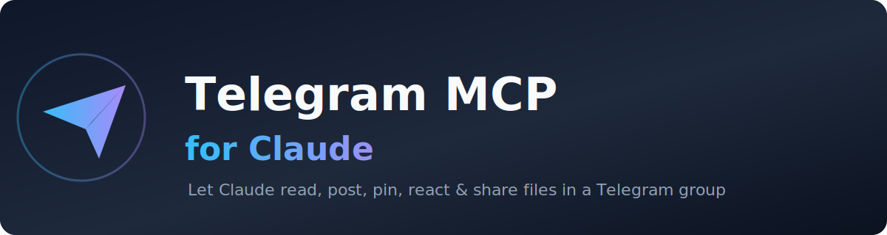
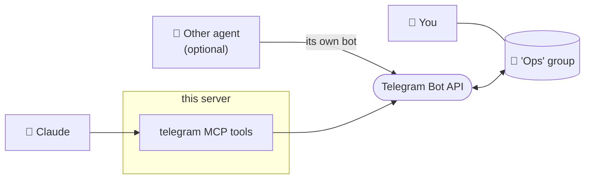
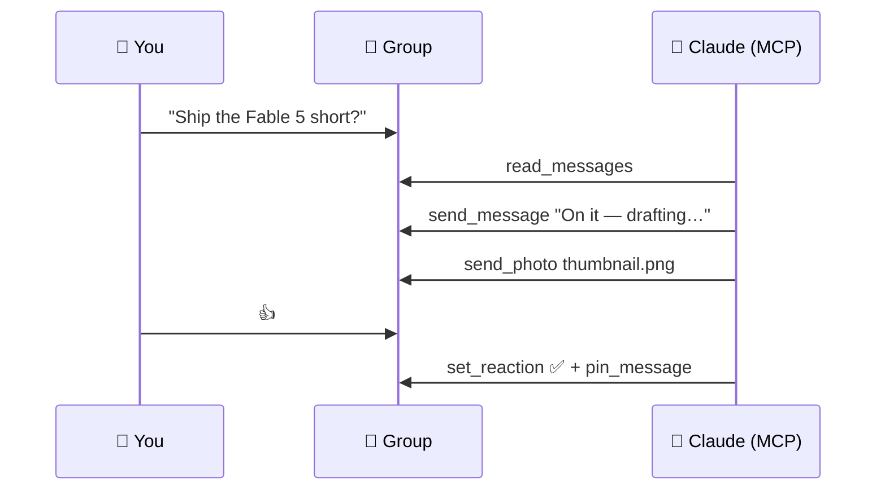

<p align="center">
  
</p>

<h1 align="center">Telegram MCP for Claude</h1>

<p align="center">
  A self-contained <a href="https://modelcontextprotocol.io">MCP</a> server that gives Claude a full set of <b>Telegram</b> tools —<br>
  so it can read, post, edit, pin, react and share files inside a dedicated Telegram group.
</p>

<p align="center">
  
  
  
  
  
</p>

---

## ✨ Why

Sometimes you want Claude **in the room** — not just answering you one-on-one, but
participating in a shared chat where you (and maybe another agent) coordinate work.

This server makes Claude a first-class member of a **dedicated Telegram group**:
it reads the conversation, posts updates, pins the decision of the day, reacts to
messages, and shares thumbnails or files — all through the official **Telegram Bot
API**. Because it's the Bot API (not your user account), the bot **only ever sees
the groups it's added to** — never your private chats.

## 🚀 Features

- 💬 **Read & post** — pull recent messages, send text (Markdown/HTML, replies, silent).
- 🖼️ **Share media** — send photos and documents by local path, URL, or `file_id`.
- ✏️ **Manage messages** — edit, delete, forward.
- 📌 **Pin / unpin** — keep the current decision or topic at the top.
- 👍 **React** — acknowledge with an emoji.
- 🔒 **Safe by design** — Bot API scope only; secrets via env; `.env` git-ignored.
- 🪶 **Tiny** — one file, two dependencies, stdio transport.

## 🧭 Architecture



> Tip: if another agent also polls Telegram, give **Claude its own bot** in the same
> group (one `getUpdates` poller per bot — see [Notes](#-notes--limits)).

## 🔄 How it works in practice



## 🧰 Tools (12)

| Tool | What it does |
|---|---|
| `get_me` | Verify token, show bot identity |
| `get_chat` | Group info (title, type, member count) |
| `read_messages` | Recent messages from the group |
| `send_message` | Post text (parse_mode, reply, silent, no-preview) |
| `send_photo` | Send a photo (local path / URL / file_id) |
| `send_document` | Send a file (local path / URL / file_id) |
| `edit_message` | Edit the bot's own message |
| `delete_message` | Delete a message (admin; &lt;48h) |
| `forward_message` | Forward a message from another chat |
| `pin_message` / `unpin_message` | Pin / unpin |
| `set_reaction` | React with an emoji (empty = clear) |

`parse_mode` accepts `Markdown`, `MarkdownV2`, or `HTML`.

## ⚡ Quick start

**1. Create a bot** — message [@BotFather](https://t.me/BotFather) → `/newbot` → copy the **token**.

**2. Disable privacy mode** so the bot sees all group messages:
`@BotFather` → `/setprivacy` → choose your bot → **Disable**.

**3. Create a group** and add your bot (plus any other members).

**4. Find the group `chat_id`** — post a message, then:
```bash
curl "https://api.telegram.org/bot<TOKEN>/getUpdates"
```
Read `result[].message.chat.id` (groups are negative, e.g. `-1001234567890`).

**5. Install & run**
```bash
python3 -m venv .venv && source .venv/bin/activate
pip install -r requirements.txt
TELEGRAM_BOT_TOKEN=... TELEGRAM_CHAT_ID=... python3 server.py   # stdio MCP
```

## 🔌 Connect to Claude

Add to your MCP client config (e.g. Claude Desktop `claude_desktop_config.json`):

```json
{
  "mcpServers": {
    "telegram": {
      "command": "/ABSOLUTE/PATH/.venv/bin/python3",
      "args": ["/ABSOLUTE/PATH/server.py"],
      "env": {
        "TELEGRAM_BOT_TOKEN": "123456:ABC...",
        "TELEGRAM_CHAT_ID": "-1001234567890"
      }
    }
  }
}
```

Restart the client → the `telegram` tools appear. Try: *"Check the Telegram group and summarize what I missed."*

## 💡 Example prompts

- "Post to the group: build is done, review link in the next message."
- "Read the last 30 messages and tell me what needs my decision."
- "Send the thumbnail at `~/YouTube/ep/thumb.png` to the group with a caption."
- "Pin the message about today's topic and react ✅ to my last one."

## 📝 Notes & limits

- `read_messages` uses `getUpdates`: Telegram keeps updates ~24h, only from chats the bot is in, and allows **one `getUpdates` poller per bot** (a webhook or a second poller → HTTP 409). Multiple agents → give each its **own bot**.
- The bot can't see messages sent **before** it joined the group.
- `pin`/`delete` require the bot to be a group **admin**.

## 🔐 Security

- Never commit your real `.env` — the token lives there (`.gitignore` excludes it).
- Bot API scope only: **no access to your personal Telegram account**.

## 🗺️ Roadmap ideas

- Inline keyboards / buttons for approvals
- Webhook mode (multi-consumer friendly)
- Message search & threaded summaries

## 🤝 Contributing

Issues and PRs welcome. Keep it small, dependency-light, and Bot-API-scoped.

## 📄 License

[MIT](LICENSE) © 2026 Yurii Kostiuk
